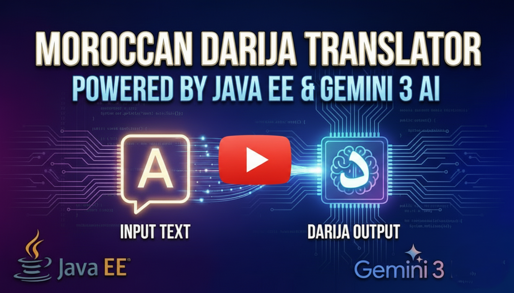

# 🌍 Moroccan Darija Translator (Powered by Gemini 3 Flash)

[](https://www.youtube.com/watch?v=ID_DE_TA_VIDEO)
*🎥 Cliquez sur l'image ci-dessus pour voir la démonstration vidéo sur YouTube.*

---

## 📝 Description
Ce projet est une application web **Java EE (JEE)** qui permet de traduire du texte vers le dialecte marocain (**Darija**). Il exploite la puissance du modèle d'intelligence artificielle **Gemini 3 Flash** de Google pour offrir des traductions naturelles et contextuelles.

## ✨ Fonctionnalités
* **Traduction Intelligente** : Utilise le modèle `gemini-3-flash-preview` pour capturer les nuances de la Darija.
* **Architecture Robuste** : Séparation claire entre la vue (JSP), le contrôleur (Servlet) et le service (Translator).
* **Sécurité** : La clé API est gérée via des variables d'environnement pour éviter toute fuite de données.
* **Gestion des Quotas** : Intégration d'une gestion d'erreur spécifique (HTTP 429) pour informer l'utilisateur en cas de dépassement de limite du Free Tier.

## 🛠️ Technologies Utilisées
* **Backend** : Java (JDK 11+), Servlets.
* **Frontend** : JSP, HTML, CSS (Bootstrap).
* **IA** : SDK Google GenAI (`com.google.genai`).
* **Build** : Maven.


## ⚙️ Configuration & Installation

### 1. Clé API
Obtenez une clé sur [Google AI Studio](https://aistudio.google.com/).

### 2. Variable d'environnement
Le projet récupère la clé via la variable `GEMINI_API_KEY`.
- **Windows (PowerShell)** : `$env:GEMINI_API_KEY="VOTRE_CLE"`
- **Linux/Mac** : `export GEMINI_API_KEY="VOTRE_CLE"`

### 3. Dépendance Maven
Ajoutez ceci dans votre `pom.xml` :
```xml
<dependency>
    <groupId>com.google.genai</groupId>
    <artifactId>google-genai</artifactId>
    <version>1.0.0</version>
</dependency>
